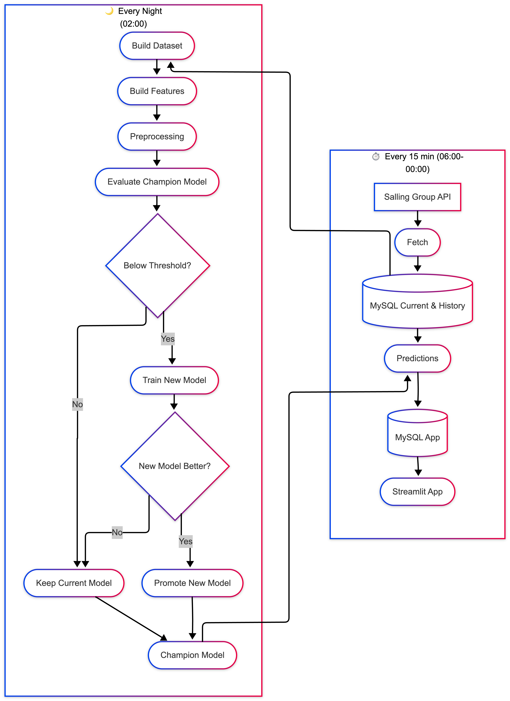

# Anti Food Waste — Aalborg
Predicts which clearance offers from Salling Group stores are likely to sell before expiry, using a live fetch-, predict-, and ML pipeline served with a Streamlit dashboard.

**Live App:** [https://app-food-waste.cloud.sdu.dk/](https://app-food-waste.cloud.sdu.dk/)

## Project structure

```
__pyache__/                # Auto-generated Python cache files
app/                       # Script for Streamlit dashboard
data/                      # Raw-,feature-, and predictions data (gitignored)
fetch_predict_pipeline/    # Fetches live clearance offers from the Salling Group API followed by predictions pipeline
ml_pipeline/               # Evaluates and retrains new model (if triggered)
models/                    # Saved champion model artifacts
outputs/                   # Log outputs from the whole pipeline
shell/                     # Shell scripts used by cron jobs
```

## Requirements
- [Docker Desktop](https://www.docker.com/products/docker-desktop/) installed and running
- A Salling Group Food Waste API token — get one at [https://developer.sallinggroup.dev/](https://developer.sallinggroup.dev/catalog/8GAPSQHBBNZD6MEBFG3GGPHWRM)

## Setup

**1. Clone the repository**
```bash
git clone https://github.com/alexchrander/M6_Project_Anti_Food_Waste.git
cd M6_Project_Anti_Food_Waste
```

**2. Create your `.env` file**
```bash
cp .env.example .env
```
Open `.env` and set your API token:
```
ANTI_FOOD_WASTE_API=your_token_here
```

**3. Start all services**
```bash
docker compose up --build
```

**4. Trigger the first run**
In a new terminal:
```bash
docker compose run --rm scheduler python fetch_prediction_pipeline/run_fetch.py
docker compose run --rm scheduler python fetch_prediction_pipeline/predict.py
```

**5. Open the app**
Go to http://localhost:8501

The scheduler automatically runs fetch + predict every 15 minutes from 06:00 to 00:00, and the ML pipeline nightly at 02:00.

## Useful commands

| Command | Description |
|---|---|
| `docker compose up --build` | Start everything |
| `docker compose down` | Stop everything (keep data) |
| `docker compose down -v` | Stop everything and delete all data |
| `docker compose logs scheduler` | View pipeline logs |
| `docker compose run --rm scheduler python fetch_prediction_pipeline/run_fetch.py` | Run fetch manually |
| `docker compose run --rm scheduler python fetch_prediction_pipeline/predict.py` | Run predictions manually |
| `docker compose run --rm scheduler python ml_pipeline/run_ml.py` | Run ML pipeline manually |

## Pipeline Diagram


