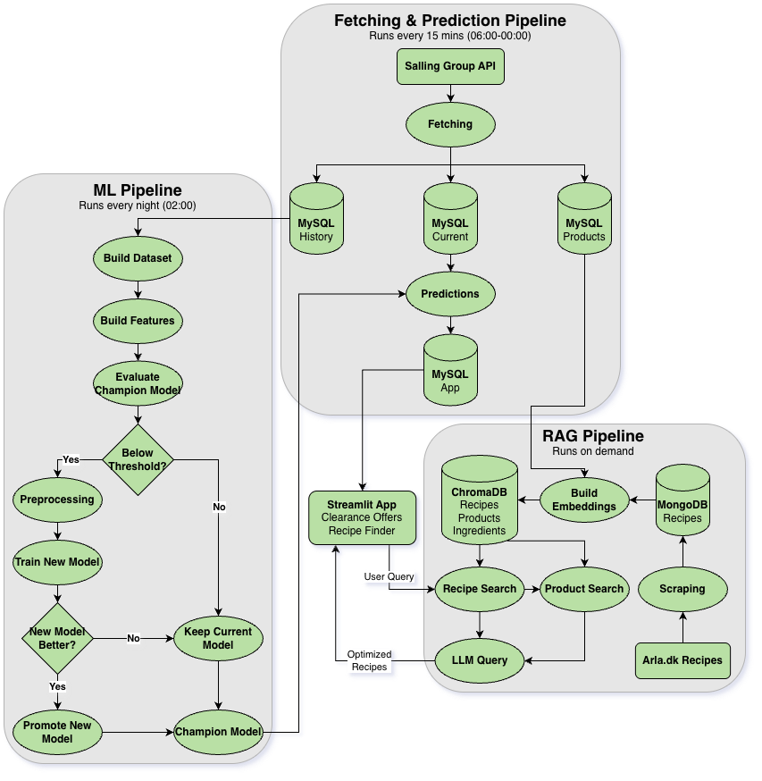

# Anti Food Waste - Aalborg
Predicts which clearance offers from Salling Group stores are likely to sell before expiry, and recommends recipes that use those products - served through a Streamlit dashboard with a live fetch-, prediction-, ML-, and RAG pipeline.

**Live App:** [https://app-food-waste.cloud.sdu.dk/](https://app-food-waste.cloud.sdu.dk/)

## Project structure

```
# Folders
analysis_&_monitoring/       # Notebooks for model development, evaluation, and connection tests
app/                         # Streamlit dashboard (Clearance Offers + Recipe Finder)
data/                        # Raw- and feature data
fetch_prediction_pipeline/   # Fetches live clearance offers from the Salling Group API followed by prediction pipeline
ml_pipeline/                 # Evaluates and retrains new model (if triggered)
models/                      # Saved champion model artifacts
outputs/                     # Log outputs from the full pipeline
rag_pipeline/                # Scrapes recipes, builds ChromaDB embeddings, and runs LLM queries
shell/                       # Shell scripts used by cron job

# Files
.gitignore                   # Files and folders excluded from Git tracking
Pipeline_Diagram.png         # Visual overview of the full pipeline
README.md                    # This file
config.py                    # Shared configuration and constants across the full pipeline
crontab                      # Cron schedule for the fetch-, prediction-, and ML pipelines
requirements.txt             # Python dependencies
```

### .gitignore file
```
*.env                        # Required environment variables
*mlruns/                     # Saved model artifacts from each retraining
*data/predictions/           # Prediction data
```

## Pipeline Diagram


